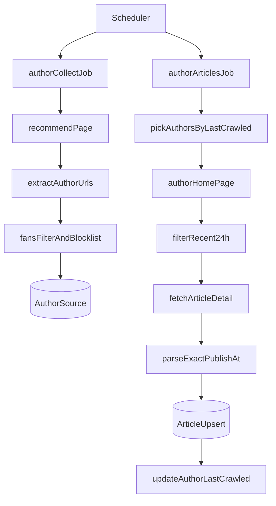

# 双线抓取改造计划

## 目标

- 第一条线：从推荐页持续提取作者主页链接，按粉丝阈值筛选后入库作者池。
- 第二条线：从作者池增量轮询作者，抓取其最近 24 小时文章并按现有规则筛选入库。
- 文章发布时间：存“具体发布时间”（优先详情页绝对时间，兜底相对时间换算）。

## 现状与改造点

- 现有流程在 [app/crawler.py](app/crawler.py) 的 `run_crawl_job()` 中是“列表抓候选文章 -> 详情补全 -> `Article` 入库”，作者仅作为文章字段存在。
- 数据模型 [app/models.py](app/models.py) 只有 `Article`，缺少作者池实体与抓取状态。
- 调度在 [app/scheduler.py](app/scheduler.py) 只有 `crawl_job` 和 `cleanup_job`，需拆分为两条抓取任务。

## 实施方案

### 1) 新增作者池模型与状态字段

- 在 [app/models.py](app/models.py) 新增 `AuthorSource`（名称可按项目风格微调），建议字段：
  - `author_url`（唯一索引）
  - `author_name`
  - `followers`
  - `status`（active/paused/invalid）
  - `first_seen_at`、`last_seen_at`
  - `last_crawled_at`（第二条线轮询游标）
  - `fail_count`、`last_error`
- 继续沿用 `db.create_all()` 自动建表（当前项目未启用迁移目录）。

### 2) 第一条线：推荐页作者采集任务

- 在 [app/crawler.py](app/crawler.py) 增加作者采集函数（如 `collect_authors_from_recommend()`）：
  - 复用现有 `crawl_recommend_page()` 的 DOM 解析能力，抽出仅作者信息的候选集合（去重 `author_url`）。
  - 对每个作者抓粉丝数（复用 `_get_author_fans_count()`），按 `CRAWL_MAX_FANS` 与黑名单规则筛选。
  - 满足条件则 upsert 到 `AuthorSource`，更新 `followers/last_seen_at`。
- 增加统计日志：采集总数、有效作者数、更新/新增/跳过数、失败数。

### 3) 第二条线：作者池增量轮询抓文

- 在 [app/crawler.py](app/crawler.py) 增加作者轮询抓文函数（如 `crawl_from_author_pool()`）：
  - 每轮按 `last_crawled_at` 升序选一批 active 作者（新增配置控制批次大小）。
  - 进入作者页后滚动抓文章卡片，提取该作者文章链接与时间信息。
  - 只保留近 24 小时（`published_at >= now-24h`）文章，再沿用现有详情抓取与 `Article` upsert 逻辑。
  - 处理完成后更新作者 `last_crawled_at`，失败累计 `fail_count` 并记录 `last_error`。

### 4) 发布时间改为“精确时间优先”

- 在 [app/crawler.py](app/crawler.py) 详情抓取逻辑中补充发布时间解析（例如详情页 JSON-LD / 页面脚本 / meta 时间字段）。
- 在 [app/utils.py](app/utils.py) 增加时间解析工具（如 `parse_publish_datetime()`）：
  - 优先解析绝对时间（`YYYY-MM-DD HH:MM:SS`、ISO8601 等）。
  - 无绝对时间时，才回退 `parse_hours_ago()` 换算。
- 入库策略：
  - `Article.published_at` 存具体时间（datetime）。
  - `publish_time_text` 保留原始文案（便于排障）。
  - `published_hours_ago` 由 `published_at` 与当前时间计算，减少近似误差。

### 5) 调度拆分与配置扩展

- 在 [app/scheduler.py](app/scheduler.py) 拆为两个 job：
  - `author_collect_job`（第一条线）
  - `author_articles_job`（第二条线）
- 在 [app/config.py](app/config.py) 与 `.env` 增加配置项（建议）：
  - `AUTHOR_COLLECT_INTERVAL_SECONDS`
  - `AUTHOR_CRAWL_INTERVAL_SECONDS`
  - `AUTHOR_CRAWL_BATCH_SIZE`
  - （可选）`AUTHOR_MAX_FAILS`
- 保留原 `cleanup_job` 不变。

### 6) 兼容与验证

- [app/routes/articles.py](app/routes/articles.py) 已使用 `Article.published_at` 展示“几小时前”，改造后无需接口字段变更，只需确认排序/展示正确。
- 回归验证重点：
  - 作者池是否持续增长且去重正确。
  - 第二条线是否按轮询增量推进，不重复扫同一批作者。
  - 24 小时过滤是否准确，发布时间是否为具体时刻。
  - 失败作者是否可观测、可恢复（`fail_count/status`）。

## 流程图（目标态）

