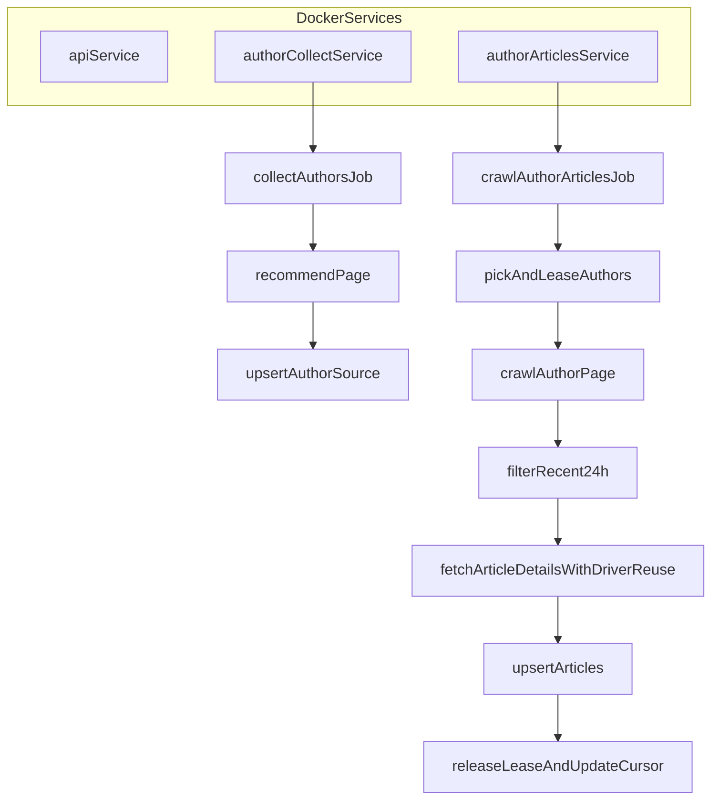

# 爬虫双进程高吞吐改造计划

## 目标

- 让“作者链接采集”和“作者文章抓取”在部署层完全解耦，互不影响。
- 通过作者领取锁、防重与事务策略，消除并发写冲突和重复抓取。
- 通过 driver 复用与批量策略提升单位时间采集量。

## 改造范围（Docker 为主）

- 入口与应用初始化：`[app/__init__.py](app/__init__.py)`, `[run.py](run.py)`, `[run_crawler.py](run_crawler.py)`
- 调度与抓取主逻辑：`[app/scheduler.py](app/scheduler.py)`, `[app/crawler.py](app/crawler.py)`, `[app/models.py](app/models.py)`
- 部署与配置：`[docker-compose.yml](docker-compose.yml)`, `[.env](.env)`, `[app/config.py](app/config.py)`

## 实施步骤

### 1) 服务级彻底分离（互不影响）

- 在 `[docker-compose.yml](docker-compose.yml)` 固化三服务职责：
  - `api`：禁止所有爬虫 job（仅 API）。
  - `author-collect`：只启 `AUTHOR_COLLECT_JOB_ENABLED=true`。
  - `author-articles`：只启 `AUTHOR_ARTICLES_JOB_ENABLED=true`。
- 保持 `[app/__init__.py](app/__init__.py)` 的 `enable_scheduler` 开关机制，确保 API 进程不会误启 scheduler。
- 为两个 crawler 服务设置不同的 `container_name`、可观测日志标签（便于定位性能瓶颈）。

### 2) 作者领取锁（防重复抓）

- 在 `[app/models.py](app/models.py)` 的 `AuthorSource` 增加字段：
  - `lease_owner`（当前领取者）
  - `lease_until`（领取过期时间）
- 在 `[app/crawler.py](app/crawler.py)` 增加“领取 -> 抓取 -> 释放/续租”流程：
  - 查询时只取 `status=active` 且 `(lease_until is null or lease_until < now)` 的作者。
  - 原子更新领取（按 `id + lease_until` 条件更新，更新成功才算领取到）。
  - 抓取结束后清理 lease 并更新 `last_crawled_at`。
- 这样多实例 `author-articles` 横向扩展时不会抓同一作者。

### 3) 事务与锁冲突治理

- 在 `[app/crawler.py](app/crawler.py)` 统一使用小事务：
  - 作者状态更新“按作者单独提交”。
  - 作者采集“按批次提交”（例如每 50 条一次），降低锁持有时间。
- 保留并增强 `_commit_with_retry()`：
  - 对 deadlock/lock wait timeout 进行退避重试。
  - 任何异常路径先 `rollback`，避免 `PendingRollbackError` 连锁。

### 4) 抓取性能重构（吞吐核心）

- 在 `[app/crawler.py](app/crawler.py)` 优化 Selenium 生命周期：
  - 避免“每条文章新建 driver”，改为“每作者/每worker复用 driver”。
  - 文章详情抓取由“逐条重建 browser”改为“批量复用 + 失败重建”。
- 调整并发策略：
  - 文章详情并发与作者并发分层控制，避免 CPU/IO 争用。
  - `AUTHOR_PER_AUTHOR_TARGET_COUNT` 与 `CRAWL_DETAIL_WORKERS` 联调，优先保证稳定后再提速。
- 减少无效抓取：
  - 先按 24h 粗过滤，再进详情页精抓，减少高成本页面访问。

### 5) 配置与运行参数模板

- 在 `[app/config.py](app/config.py)` / `[.env](.env)` 增加并规范：
  - `AUTHOR_LEASE_SECONDS`
  - `AUTHOR_COLLECT_COMMIT_BATCH_SIZE`
  - `AUTHOR_ARTICLES_WORKERS`（如采用多worker）
  - `JOB_JITTER_SECONDS`（错峰抖动）
- 为 Docker 场景给出推荐初始值（稳定优先）：
  - collect 间隔 90s，articles 间隔 120s，jitter 10~20s。

### 6) 验证与压测基线

- 功能验证：
  - 两条线进程独立，停一条不影响另一条。
  - 无重复领取同一作者。
  - `articles` 入库稳定且 `published_at` 持续有值。
- 稳定性验证：
  - 观察 1205/1213、`PendingRollbackError` 是否清零或显著下降。
- 性能验证：
  - 对比改造前后“每 10 分钟新增文章数”“作者处理数”“失败率”。

## 目标态流程图

