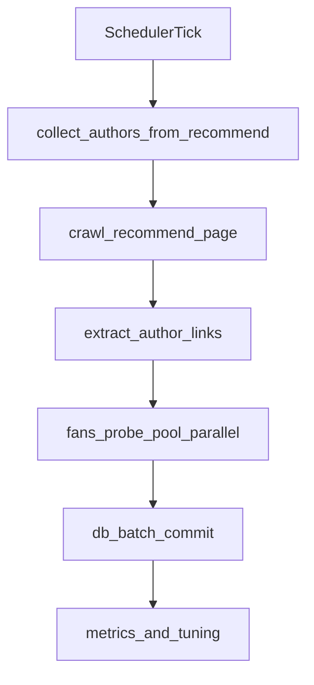

# 爬虫提速实施计划

## 目标与范围

- 目标：最大化“新闻列表抓取 + 作者链接采集”吞吐，并保持可持续运行。
- 范围：优先改造采集链路（`collect_authors_from_recommend`），其次优化列表抓取等待策略，最后再考虑全链路（详情页）激进优化。
- 关键文件：
  - [d:/Project/WeChat/ideara/jrtt-tool-server/app/crawler.py](d:/Project/WeChat/ideara/jrtt-tool-server/app/crawler.py)
  - [d:/Project/WeChat/ideara/jrtt-tool-server/app/config.py](d:/Project/WeChat/ideara/jrtt-tool-server/app/config.py)
  - [d:/Project/WeChat/ideara/jrtt-tool-server/app/scheduler.py](d:/Project/WeChat/ideara/jrtt-tool-server/app/scheduler.py)
  - [d:/Project/WeChat/ideara/jrtt-tool-server/docker-compose.yml](d:/Project/WeChat/ideara/jrtt-tool-server/docker-compose.yml)

## 现状瓶颈（按收益排序）

- 作者粉丝获取串行：`collect_authors_from_recommend()` 对每个作者依次调用 `_get_author_fans_count()`，单轮时长随作者数线性增长。
- 列表抓取固定等待偏多：`crawl_recommend_page()` 存在多段 `sleep`，在页面已就绪时仍等待。
- 调度频率与单轮时长耦合：`AUTHOR_COLLECT_INTERVAL_SECONDS` 较大时吞吐受限；较小时若单轮未提速会堆积资源压力。

## 实施步骤

### 阶段1（高收益、低风险）

- 在 `collect_authors_from_recommend()` 中新增“作者粉丝探测并发池”（建议 2~4）：
  - 仅并发执行“访问作者页并提取粉丝”。
  - DB 写入仍保持当前批量提交节奏（降低锁竞争与回滚风险）。
- 增加新配置项（`app/config.py`）：
  - `AUTHOR_COLLECT_FANS_WORKERS`（默认 1，兼容旧行为）
  - `AUTHOR_COLLECT_FANS_TIMEOUT_SECONDS`（控制单作者探测超时）
- 结果：在作者候选较多时显著缩短单轮采集总时长。

### 阶段2（中收益、低风险）

- 优化 `crawl_recommend_page()`：
  - 将部分固定 sleep 改为“短 sleep + 条件等待（卡片数增长/关键元素出现）”。
  - 增加“连续无新增卡片提前收敛”策略，避免无效滚动。
- 增加配置项：
  - `CRAWL_LIST_NO_GROWTH_EARLY_STOP_ROUNDS`（如 1~2）
  - `CRAWL_LIST_STEP_WAIT_SECONDS`（滚动后的短等待，替代硬编码）

### 阶段3（部署与调度协同）

- 统一 worker 提速参数（`docker-compose.yml` + `.env`）：
  - 先采用平衡档：`AUTHOR_COLLECT_TARGET_COUNT=100`、`CRAWL_LIST_SCROLL_ROUNDS=8`、`AUTHOR_COLLECT_INTERVAL_SECONDS=300`。
  - `author-collect` 默认优先无头模式做 A/B（若风控上升再回退）。
- 调度策略（`app/scheduler.py`）：保留 `max_instances=1`，先靠阶段1/2降低单轮耗时，再按监控下调间隔。

### 阶段4（可选激进项）

- 若仍需更高速度，再优化全链路（详情页/阅读量）并加开关回退：
  - 缩短详情页就绪等待与重试链路。
  - 对阅读量抓取从“按文章访问作者页”改为“每作者一次批量映射”。

## 验证与回滚

- 核心指标（每轮记录）：
  - 列表阶段耗时、作者探测总耗时、单轮总耗时。
  - 成功入库作者数、失败率、空结果率。
- 观测窗口：至少连续 20~30 轮。
- 回滚策略：所有提速改动通过新环境变量开关可降级到旧逻辑（workers=1、关闭 early-stop、恢复原等待参数）。

## 执行顺序（建议）

- 先做阶段1并上线观察；
- 指标稳定后做阶段2；
- 再做阶段3参数压测；
- 最后视需要做阶段4激进优化。

## 流程示意

